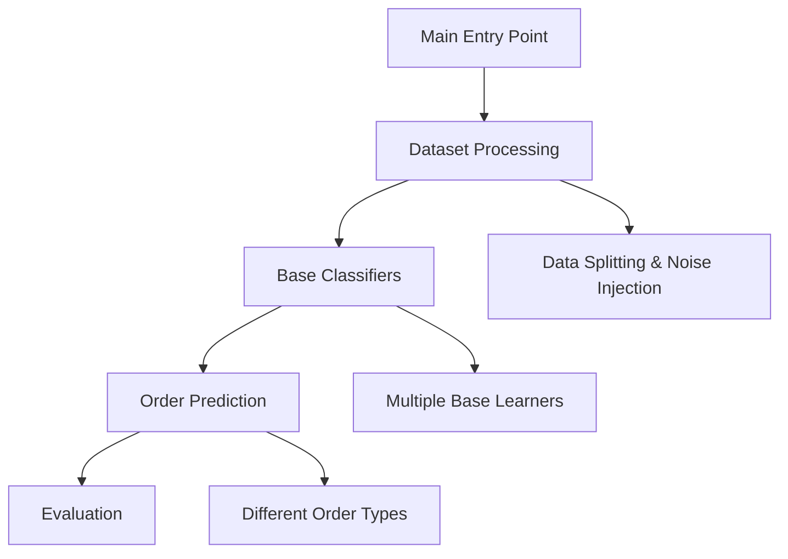

# Pre-Order for Multi-label Classification

This project is a collection of Python scripts for machine learning tasks, specifically focusing on multi-label classification problems. It includes implementations of various predictors and pairwise classifiers.

## Getting Started

These instructions will get you a copy of the project up and running on your local machine for development and testing purposes.

### Prerequisites

The project requires the following Python libraries:

- numpy
- scipy
- pandas
- sklearn

You can install these using pip:

```sh
pip install numpy scipy pandas sklearn
```

### Running the Scripts

The main scripts in this project are:

- [`main.py`](command:_github.copilot.openRelativePath?%5B%22main.py%22%5D "main.py")

You can run these scripts from the command line as follows:

```sh
python main.py
```

## Code Structure

The project includes the following classes.
These classes implement various prediction algorithms and evaluation metrics.



## Datasets

The scripts use datasets in ARFF format. The datasets should be placed in the [`./data/`](command:_github.copilot.openRelativePath?%5B%22.%2Fdata%2F%22%5D "./data/") directory. The scripts are currently configured to use the following datasets:

- emotions.arff
- scene.arff
- CHD_49.arff
- Yeast.arff
- Water-quality.arff

## Contributing

Please read CONTRIBUTING.md for details on our code of conduct, and the process for submitting pull requests to us.

## License

This project is licensed under the MIT License.

## Examples

y_predict_partial_abstention = [[1, 0, 1, 0, 0, 0], [1, 0, 1, 0, 0, 1], 
                                [1, 0, 1, 1, 0, 0], [1, 0, 1, 1, 0, 1], [0, 0, 1, 1, 0, 1]]  
                             != [-1, 0, 1, -1, 0, -1]  

y_predict_partial_abstention = [1, 0, 1, -1, 0, -1] % -1 = {0, 1}

y_true                       = [0, 0, 1,  1, 0, 0]

AREC(y_predict_partial_abstention, y_true) = ([[0 \in 1]] + [[0 \in 0]] + [[1 \in -1]] + [[0 \in 0]] +  [[0 \in -1]])/6
                                           = (    0       +      1      +      1       +      1      +       1      )/6
                                           = 4/6

AABS(y_predict_partial_abstention) = (1/K)\sum_{k=1}^K [[y^k_predict = -1]] = 2/6 

REC(y_predict_partial_abstention, y_true) = 1 if AREC(y_predict_partial_abstention, y_true) = 1 

ABS(y_predict_partial_abstention) = K*AABS(y_predict_partial_abstention)

