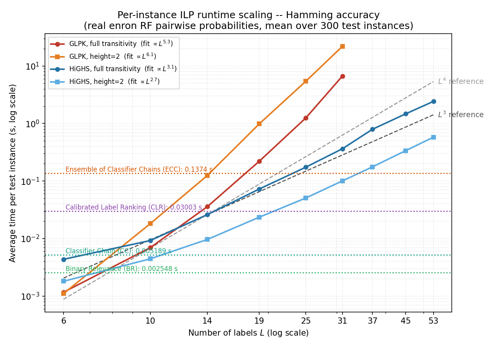
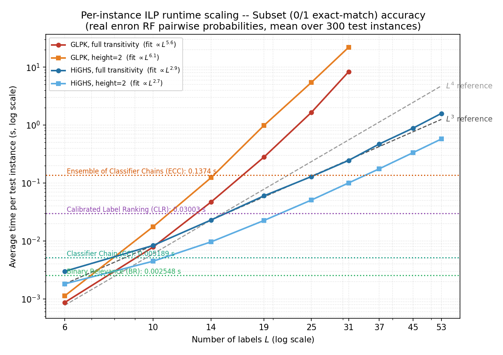

# Response to Reviewer 1: computational cost and scaling

Reviewer 1 asks us to quantify how the per-instance ILP cost grows with the
number of labels `L`, and to compare it against the baselines so the
accuracy/runtime trade-off is explicit. All numbers below are the **average
inference time per test instance** on the real enron data (K=53, RF pairwise
classifiers, 300 test instances). Scripts: `scripts/bench_step*.py`; raw data:
`runtime_scaling_data.csv`.

## 1. ILP size grows as O(L²) / O(L³)

The method solves one ILP per test instance. Its size (from
`searching_algorithms.py`) is:

| `L` | binary variables | equality constraints | transitivity constraints |
|----:|---:|---:|---:|
| 6   | 60    | 15    | 120 |
| 14  | 364   | 91    | 2,184 |
| 19  | 684   | 171   | 5,814 |
| 45  | 3,960 | 990   | 85,140 |
| 53  | 5,512 | 1,378 | 140,556 |

Variables scale as **O(L²)**, transitivity constraints as **O(L³)**. From
`L=6` to `L=53`: ×92 variables, ×1,171 constraints.

## 2. Measured runtime vs L

Average solve time per test instance (seconds), sweeping label-subset size on
the same trained enron model (only `L` varies); each value is the mean over the
two target metrics:

| `L` | GLPK full | GLPK h=2 | HiGHS full | HiGHS h=2 |
|----:|---:|---:|---:|---:|
| 6  | 0.001       | 0.001         | 0.004 | 0.002 |
| 14 | 0.042       | 0.125         | 0.025 | 0.010 |
| 19 | 0.251       | 0.987         | 0.066 | 0.023 |
| 25 | 1.46        | 5.44          | 0.152 | 0.051 |
| 31 | 7.50        | 21.96         | 0.305 | 0.101 |
| 37 | not measured | not measured | 0.632 | 0.176 |
| 45 | not measured | not measured | 1.178 | 0.336 |
| 53 | >48h (DNF)  | 621.9 (~10 min) | 2.007 | 0.577 |

GLPK at `L∈{37,45}` was not run (a single instance already needs seconds to
tens of seconds by `L=31`). At `L=53` we timed GLPK **directly**: the
height=2 variant solves in **621.9 s (~10 min/instance, ~1000× slower than
HiGHS)**, while full transitivity **did not finish within a 48-hour wall-clock
limit** (SLURM job, hard-capped). These direct `K=53` measurements, per target
metric and preference order, are in the companion table `tikz/runtime_at_53.tex`;
the four scaling figures are under `tikz/`.

Fitting a power law `time ∝ L^x` to the measured curves gives:

| curve | fitted exponent |
|---|---|
| GLPK, full transitivity | L^5.4 |
| GLPK, height=2 | L^6.1 |
| HiGHS, full transitivity | L^3.0 |
| HiGHS, height=2 | L^2.7 |

The figure below overlays these curves against explicit `L^3` and `L^4`
reference lines: HiGHS (full) sits almost exactly on the `L^3` reference, while
GLPK is far steeper.

The exponents above are fitted on `L≤31`, so it is worth checking them against
the direct `L=53` measurements. For GLPK **height=2** the fit roughly holds:
extrapolating `L^6.1` predicts ~500 s and we measured 621.9 s (same order).
For GLPK **full transitivity** the fit **catastrophically underestimates**:
extrapolating `L^5.4` predicts ~1 min at `L=53`, but the solve did not finish in
48 hours (>2600× longer). This is why we do not extrapolate GLPK past its
measured regime in the figures and why enron uses HiGHS.

### Per-target-metric breakdown

The ILP is solved separately for each target metric. Runtime is essentially
identical across the two metrics (same variables and constraints; only the
objective vector differs), so we give one figure per metric. Both include the
baselines and the `L^3`/`L^4` reference lines.

Hamming accuracy:

Subset (0/1 exact-match) accuracy:

Fitted exponents per metric: GLPK `L^5.3`/`L^5.6` (full, Hamming/Subset),
HiGHS `L^3.1`/`L^2.9` (full). The two metrics track each other closely.

- **GLPK (default solver) does not scale**: cost grows ~L^5.4 (full) / ~L^6.1
  (height=2), a single instance already needs seconds at `L=25` and tens of
  seconds by `L=31`. At `L=53` full transitivity does not finish in 48 h and
  height=2 needs ~10 min/instance (~1000× slower than HiGHS): unusable at scale.
- **HiGHS scales ~L^3.0** (matching the O(L³) constraint count) and stays
  practical: about **2 s / instance** at `L=53` (full transitivity) or **~0.6 s**
  with the height=2 variant.

## 3. Trade-off vs baselines and guideline

Baselines do no per-instance optimization (per-instance inference on enron):

| BR | CC | CLR | ECC | BOPOs (HiGHS, h=2) | BOPOs (HiGHS, full) |
|---:|---:|----:|----:|-------------------:|--------------------:|
| ~0.0025 s | ~0.005 s | ~0.030 s | ~0.137 s | ~0.6 s | ~2 s |

The extra cost of BOPOs is a single per-instance ILP. It is parallelizable
across the test set (`PREORDER_SEARCH_N_JOBS`), and it sits on top of the same
pairwise-probability stage that CLR already pays. Guideline:

- **`L ≲ 15`**: any solver/variant is effectively free.
- **`15 ≲ L ≲ 30`**: use HiGHS (GLPK already too slow).
- **`L ≳ 30`**: use HiGHS; prefer height=2 if latency matters (~0.6 s vs ~2 s).

## Note on the two solvers (fairness)

GLPK and HiGHS are interchangeable MILP back-ends solving the **identical** ILP
and returning the **same optimal solution**; they differ only in speed, so
**accuracy is unchanged by the solver choice**. Both are used only by BOPOs (not
by the baselines), and we keep the solver consistent between the reported
accuracy and runtime.

## Notation

- **`L`**: number of labels (candidate labels for one instance).
- **`O(L²)`, `O(L³)`**: big-O growth order. `O(L²)` means the quantity grows
  proportionally to `L²` up to a constant, i.e. doubling `L` roughly quadruples
  it. Used here for the ILP's variable count (`O(L²)`) and constraint count
  (`O(L³)`).
- **`∝`**: "proportional to". `time ∝ L^x` means `time = c · L^x` for some
  constant `c`; on a log-log plot this is a straight line of slope `x`.
- **`L^3`, `L^4` reference lines**: straight lines of exact slope 3 and 4 on the
  log-log axes, drawn so the reader can visually compare the measured curves'
  slopes against pure cubic/quartic growth (no fitting, fixed reference).
- **fitted `L^x`**: the exponent `x` obtained by least-squares fitting a line to
  `(log L, log time)`; it is the empirical growth rate of that curve.
- **full transitivity vs height=2**: two BOPOs variants. "full" enforces
  complete transitivity of the preference order; "height=2" restricts the order
  to depth 2, giving a different (usually cheaper for HiGHS) constraint set.
- **GLPK / HiGHS**: two MILP solvers. GLPK (`cvxopt.glpk.ilp`) is the paper's
  default; HiGHS (`scipy.optimize.milp`) is the faster back-end. Same ILP, same
  optimal solution, different speed.

## Setup

enron (K=53), 70/30 split (`RandomState(0)`), RF pairwise classifiers, noise
free; smaller `L` are label subsets of this one model. Average over 300 test
instances (fewer for the heaviest `L=53` full-transitivity config to bound wall
time). Env: `research_preorder_mlc` (sklearn 1.6.1, scipy 1.15.3, cvxopt 1.3.2).
GLPK via `cvxopt.glpk.ilp`, HiGHS via `scipy.optimize.milp`.
