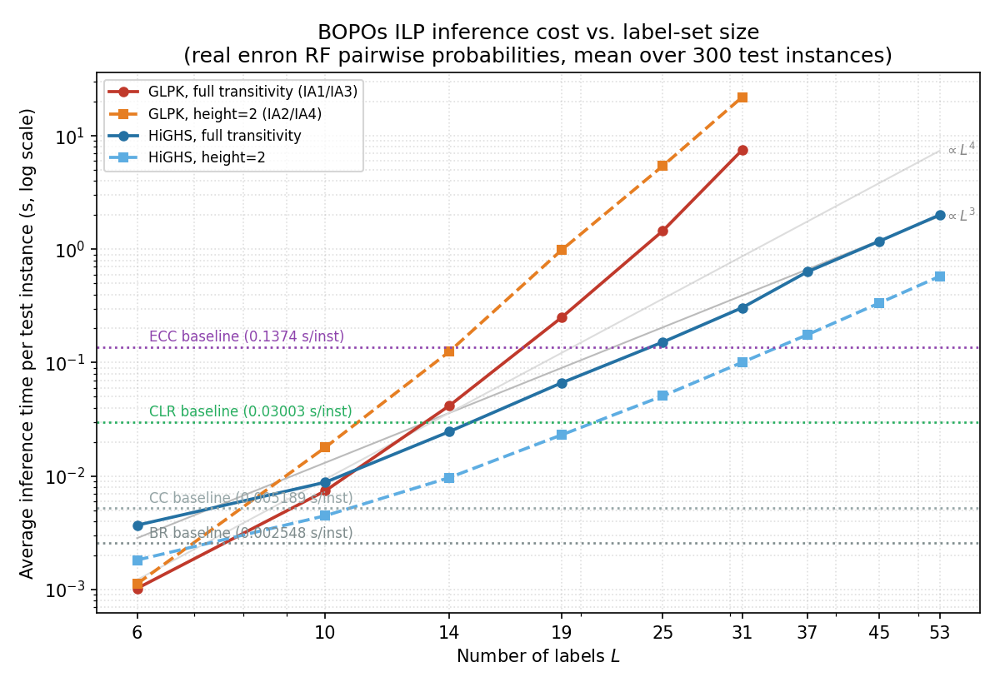
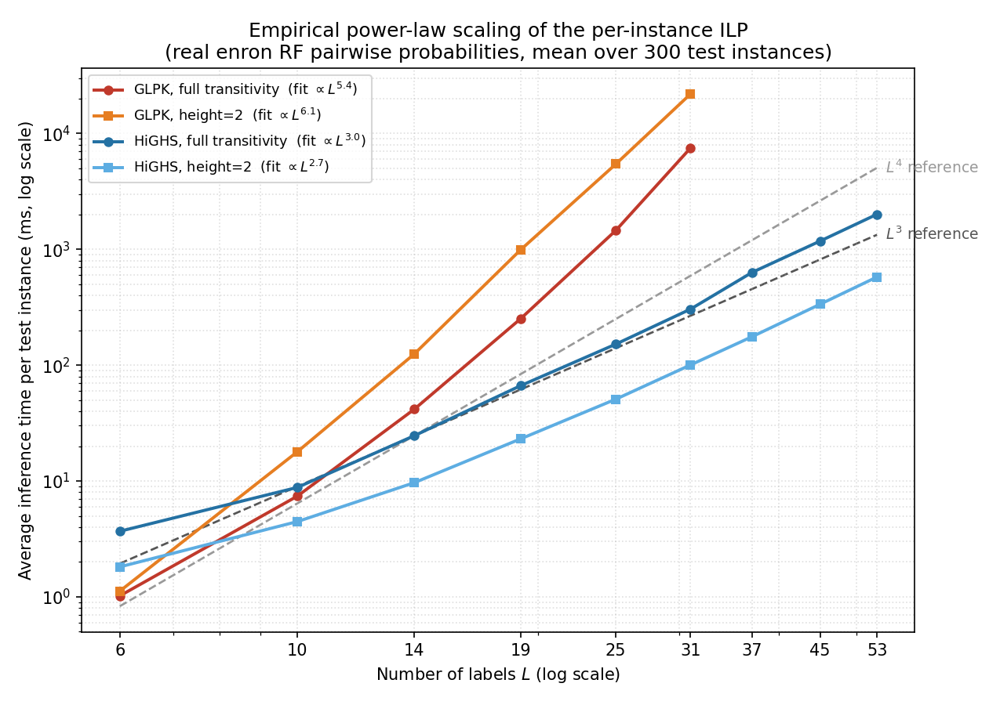

# Response to Reviewer 1: computational cost and scaling

Reviewer 1 asks us to quantify how the per-instance ILP cost grows with the
number of labels `L`, and to compare it against the baselines so the
accuracy/runtime trade-off is explicit. All numbers below are the **average
inference time per test instance** on the real enron data (K=53, RF pairwise
classifiers, 300 test instances). Scripts: `scripts/bench_step*.py`; raw data:
`runtime_scaling_data.csv`.

## 1. ILP size grows as O(L²) / O(L³)

The method solves one ILP per test instance. Its size (from
`searching_algorithms.py`) is:

| `L` | binary variables | equality constraints | transitivity constraints |
|----:|---:|---:|---:|
| 6   | 60    | 15    | 120 |
| 14  | 364   | 91    | 2,184 |
| 19  | 684   | 171   | 5,814 |
| 45  | 3,960 | 990   | 85,140 |
| 53  | 5,512 | 1,378 | 140,556 |

Variables scale as **O(L²)**, transitivity constraints as **O(L³)**. From
`L=6` to `L=53`: ×92 variables, ×1,171 constraints.

## 2. Measured runtime vs L

Average solve time per test instance (ms), sweeping label-subset size on the
same trained enron model (only `L` varies):

| `L` | GLPK full | GLPK h=2 | HiGHS full | HiGHS h=2 |
|----:|---:|---:|---:|---:|
| 6  | 1.0     | 1.1      | 3.7   | 1.8  |
| 14 | 41.6    | 124.9    | 24.6  | 9.7  |
| 19 | 250.9   | 987.0    | 66.4  | 23.1 |
| 25 | 1,455   | 5,444    | 151.9 | 50.9 |
| 31 | 7,500   | 21,957   | 304.8 | 100.5 |
| 37 | impractical | impractical | 632   | 176  |
| 45 | impractical | impractical | 1,178 | 336  |
| 53 | impractical | impractical | 2,007 | 577  |

(GLPK capped at `L≤31`: beyond that a single instance exceeds practical time.)

Fitting a power law `time ∝ L^x` to the measured curves gives:

| curve | fitted exponent |
|---|---|
| GLPK, full transitivity | L^5.4 |
| GLPK, height=2 | L^6.1 |
| HiGHS, full transitivity | L^3.0 |
| HiGHS, height=2 | L^2.7 |

The figure below overlays these curves against explicit `L^3` and `L^4`
reference lines: HiGHS (full) sits almost exactly on the `L^3` reference, while
GLPK is far steeper.

- **GLPK (default solver) does not scale**: cost grows ~L^5.4 (full) / ~L^6.1
  (height=2) and a single instance already needs seconds at `L=25` and tens of
  seconds by `L=31`. It is impractical beyond `L≈37`.
- **HiGHS scales ~L^3.0** (matching the O(L³) constraint count) and stays
  practical: about **2 s / instance** at `L=53` (full transitivity) or **~0.6 s**
  with the height=2 variant.

## 3. Trade-off vs baselines and guideline

Baselines do no per-instance optimization (per-instance inference on enron):

| BR | CC | CLR | ECC | BOPOs (HiGHS, h=2) | BOPOs (HiGHS, full) |
|---:|---:|----:|----:|-------------------:|--------------------:|
| ~2.5 ms | ~5 ms | ~30 ms | ~137 ms | ~0.6 s | ~2 s |

The extra cost of BOPOs is a single per-instance ILP. It is parallelizable
across the test set (`PREORDER_SEARCH_N_JOBS`), and it sits on top of the same
pairwise-probability stage that CLR already pays. Guideline:

- **`L ≲ 15`**: any solver/variant is effectively free.
- **`15 ≲ L ≲ 30`**: use HiGHS (GLPK already too slow).
- **`L ≳ 30`**: use HiGHS; prefer height=2 if latency matters (~0.6 s vs ~2 s).

## Note on the two solvers (fairness)

GLPK and HiGHS are interchangeable MILP back-ends solving the **identical** ILP
and returning the **same optimal solution**; they differ only in speed, so
**accuracy is unchanged by the solver choice**. Both are used only by BOPOs (not
by the baselines), and we keep the solver consistent between the reported
accuracy and runtime.

## Setup

enron (K=53), 70/30 split (`RandomState(0)`), RF pairwise classifiers, noise
free; smaller `L` are label subsets of this one model. Average over 300 test
instances (fewer for the heaviest `L=53` full-transitivity config to bound wall
time). Env: `research_preorder_mlc` (sklearn 1.6.1, scipy 1.15.3, cvxopt 1.3.2).
GLPK via `cvxopt.glpk.ilp`, HiGHS via `scipy.optimize.milp`.
